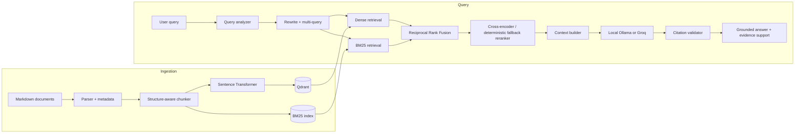

# ResolveAI

**Enterprise Technical Support & Incident Resolution RAG Platform**

ResolveAI is a locally runnable retrieval-augmented generation system for technical troubleshooting. It searches real public support questions and official product documentation, then produces a clear, cited answer for a support administrator.

The end-user application uses 187 real Stack Overflow questions with their accepted answers and six official references. The community corpus covers payments, checkout, frontend failures, APIs, authentication, OAuth, Node.js, Docker, Nginx, PostgreSQL, Kubernetes, Redis, and Apache Kafka. Every imported record retains its publisher, original URL, author attribution, and license. A separate fictional Nexora corpus remains in the repository only for reproducible retrieval evaluation and is excluded from the application by default.

## Why this project exists

Support engineers often have to search across solved community questions and official documentation. ResolveAI turns that fragmented search into one readable troubleshooting brief while keeping the original evidence one click away. The end-user interface deliberately hides model and retrieval internals.

## Architecture



The backend prefers Qdrant with `BAAI/bge-small-en-v1.5` when it is available. It falls back to a deterministic local TF-IDF cosine retriever when Qdrant or model dependencies are unavailable, which keeps development, tests, and evaluation usable without network access. BM25 remains independent and is especially valuable for `DB-104`, `PAY-307`, endpoint paths, and exact versions.

## What is implemented

- Markdown parsing with YAML-style frontmatter preservation.
- Heading-aware chunking targeting roughly 550 tokens and preserving code/log blocks and section context.
- Configurable sentence-transformer embeddings and persistent Qdrant indexing.
- An independent BM25 index.
- Regex/heuristic query analysis with service, version, error-code, technology, and environment extraction.
- Identifier-preserving rewriting and three-query expansion.
- Conservative metadata filters with automatic relaxation when candidate recall is low.
- Multi-query dense and sparse retrieval.
- Reciprocal Rank Fusion using `1 / (k + rank)`, never raw-score averaging.
- A replaceable reranker interface with an offline deterministic implementation and a configured cross-encoder production model.
- Authority-, recency-, diversity-, and token-budget-aware context selection.
- Local Ollama and Groq integrations behind one grounded synthesis interface, with explicit guided fallback when no model is connected.
- Multi-turn investigations that pass the recent conversation to the model so administrators can add errors and test results naturally.
- Local Markdown, text, and text-based PDF upload with size/type validation and immediate indexing.
- Per-answer helpful/not-helpful feedback stored locally for later quality analysis.
- Citation allow-list validation, citation coverage, and explainable evidence-support categories.
- A low-evidence guard that returns the required insufficient-evidence response.
- Per-stage timings and a detailed retrieval debug response.
- Retrieval ablations, standard IR metrics, and JSON/CSV output.
- Administrator-focused React pages for Overview, Investigation Desk, Knowledge Library, Solved Cases, and source-document viewing. Model internals and benchmark screens are intentionally kept out of the end-user interface.

## Real-world application corpus

The default application corpus is entirely public and traceable:

| Source | Records | What is used | Attribution |
|---|---:|---|---|
| Stack Overflow | 187 | Real questions and accepted answers across 17 technical tags and 12 support areas | Original author, answer author, URL, and CC BY-SA 4.0 license |
| Official documentation | 6 | Selected PostgreSQL, Kubernetes, Redis, and Apache Kafka guidance | Publisher, URL, and upstream license |

Run `python scripts/import_stackoverflow.py` to reproduce the community dataset through the official Stack Exchange API. The exact imported records are listed in `data/real/stackoverflow_manifest.json`.

## Synthetic evaluation corpus

`data/golden/` is a fictional canonical fact layer used only for controlled retrieval benchmarks. `scripts/generate_corpus.py` deterministically turns those facts into long-form Markdown. Set `INCLUDE_SYNTHETIC_CORPUS=true` only when you intentionally want to include it; the normal application leaves it out.

The committed corpus contains:

| Type | Examples |
|---|---|
| Troubleshooting | Payment, Authentication, Database, Kafka, Redis, Orders, Kubernetes-style operating guidance |
| Runbooks | Production payment, PostgreSQL failover, Kafka lag, Redis recovery, auth recovery, rollback |
| Incidents | 10 SEV postmortems including `INC-2025-018`, `INC-2025-007`, and `INC-2026-002` |
| Support tickets | 10 informal customer cases including `SUP-1842` and `SUP-1861` |
| API docs | Payment, Order, Inventory, and Authentication APIs |
| Release notes | Payment 4.1, 4.2, 4.2.1, 4.3 and Order 3.7.2 |
| Architecture/database | Checkout flow and PostgreSQL 16 migration/pool sizing |
| Reference | A 30-code error catalog |

The central difficult case is deliberate: Payment Service 4.2 changed each pod to a fixed connection-pool maximum of 40. At 12 replicas, that could exceed the PostgreSQL 16 session budget and emit `DB-104`. Release 4.2.1 restores version-aware sizing with a documented baseline of `maximumSize=24`, `minimumIdle=6`, and `connectionTimeoutMs=3000`. Old and current records coexist so version and document authority matter.

## Evaluation

The included 50-question set covers exact identifiers, semantic troubleshooting, version sensitivity, multi-document questions, incident resolution, and unanswerable questions.

The checked-in results were produced by `python scripts/evaluate.py` on the dependency-free local dense fallback. They are measurements, not marketing claims:

| Retriever | Hit Rate@5 | Recall@5 | Precision@5 | MRR | nDCG@5 |
|---|---:|---:|---:|---:|---:|
| Dense | 0.58 | 0.3333 | 0.1160 | 0.4717 | 0.5364 |
| BM25 | 0.56 | 0.4400 | 0.1480 | 0.4367 | 0.4921 |
| Hybrid | 0.56 | 0.4300 | 0.1440 | 0.4500 | 0.5484 |
| Hybrid + rewrite | **0.86** | **0.5300** | **0.2040** | 0.6483 | 0.5358 |
| Hybrid + rewrite + fallback reranker | 0.74 | 0.4600 | 0.1760 | **0.7267** | **0.6835** |

These results show the practical trade-off: query rewriting produces the best Hit Rate@5 and Recall@5, while the fallback reranker improves MRR and nDCG@5 by moving the strongest evidence upward. A proper Qdrant + cross-encoder run should still be evaluated separately before making production performance claims. The result files live in `evaluation/results/summary.json` and `.csv`.

## Quick start

### 1. Infrastructure and Python

```bash
docker compose up -d qdrant
cd backend
python -m venv .venv
# Windows: .venv\Scripts\activate
# macOS/Linux: source .venv/bin/activate
pip install -r requirements.txt
copy .env.example .env  # Windows
# cp .env.example .env  # macOS/Linux
cd ..
python scripts/import_stackoverflow.py  # refresh real solved support questions
python scripts/import_public_docs.py    # refresh official upstream references
python scripts/ingest.py
cd backend
uvicorn app.main:app --reload
```

The API is available at `http://localhost:8000`; interactive OpenAPI docs are at `http://localhost:8000/docs`.

### 2. Frontend

```bash
cd frontend
npm install
npm run dev
```

Open `http://localhost:5173`.

### Public deployment

**Live demo:** [resolveai-support-rmt4.onrender.com](https://resolveai-support-rmt4.onrender.com)

The root `Dockerfile` builds the React frontend and serves it together with the FastAPI backend from one public URL. `render.yaml` defines a free Render web service with `/api/health` as its health check. Create a Render Blueprint from the GitHub repository to deploy it. Free services can take a short time to wake after a period of inactivity.

### Local AI and credential-free mode

The default uses `LLM_PROVIDER=auto`. It first looks for a running Ollama model, then uses Groq when configured, and otherwise shows an honest guided-fallback state in the interface.

For private local generation, install Ollama, pull a model, and set the model name:

```bash
ollama pull llama3.2:3b
```

```dotenv
LLM_PROVIDER=ollama
LLM_MODEL=llama3.2:3b
OLLAMA_URL=http://127.0.0.1:11434
```

To use Groq instead, set:

```dotenv
LLM_PROVIDER=groq
GROQ_API_KEY=your_key
LLM_MODEL=a-current-supported-groq-chat-model
```

The model name is environment-controlled so an obsolete provider model is never baked into application logic.

## Common commands

```bash
make infrastructure  # persistent Qdrant
make corpus          # regenerate deterministic corpus
make ingest          # embed and index Qdrant
make backend         # FastAPI development server
make frontend        # Vite development server
make evaluate        # retrieval ablations
make test            # backend tests
```

## API

| Method | Route | Purpose |
|---|---|---|
| POST | `/api/query` | Grounded answer with citations and optional debug data |
| POST | `/api/query/debug` | Same pipeline with the full retrieval trace |
| POST | `/api/ingest` | Reload local document/chunk state |
| POST | `/api/documents/upload` | Validate, store, and immediately index a local Markdown, text, or PDF document |
| POST | `/api/feedback` | Save helpful/not-helpful answer feedback locally |
| GET | `/api/ai/status` | Report whether real AI synthesis or guided fallback is active |
| GET | `/api/documents` | List/filter knowledge documents |
| GET | `/api/documents/{document_id}` | Read a complete source document |
| GET | `/api/incidents` | List incident postmortems |
| GET | `/api/evaluation/results` | Read checked-in benchmark output |
| GET | `/api/metrics` | Query/document/chunk metrics |
| GET | `/api/health` | Readiness and active-provider information |

Example:

```bash
curl -X POST http://localhost:8000/api/query/debug \
  -H "Content-Type: application/json" \
  -d '{"query":"PostgreSQL says password authentication failed for user postgres. What should I check?"}'
```

The response includes `answer`, validated `citations`, selected `sources`, evidence support, latency, and every retrieval stage: rewritten query, entities, subqueries, filters, dense candidates, BM25 candidates, RRF ranks, reranker scores, selected context, and timings.

## Demo questions

1. PostgreSQL says password authentication failed for user postgres. What should I check?
2. Why does my Kubernetes pod say it has unbound PersistentVolumeClaims?
3. How can I add a health check to a Redis Docker container?
4. How do I connect to Kafka running inside a Docker container?
5. Why can DBeaver only see the default PostgreSQL database?
6. How do I decode a Kubernetes secret?
7. What is a Kafka bootstrap server?
8. What is the difference between Redis Pub/Sub and Streams?

Try an unrelated question such as “How do I repair a bicycle chain?” The system returns an insufficient-evidence response instead of inventing an answer.

## Project structure

```text
resolveai/
├── backend/app/          # API, schemas, ingestion, retrieval, RAG
├── backend/tests/        # unit + API integration tests
├── frontend/src/         # React enterprise UI
├── data/real/            # manifest for imported real-world records
├── data/raw/external/    # official technology documentation
├── data/raw/stackoverflow/ # real questions and accepted answers
├── data/golden/          # synthetic benchmark facts, excluded by default
├── data/evaluation/      # 50-question ground truth
├── evaluation/results/   # measured JSON and CSV output
├── scripts/              # corpus generation, ingestion, evaluation
├── docker-compose.yml
└── Makefile
```

## Safety and reliability choices

- Query input length is validated by Pydantic.
- CORS defaults to the local frontend origin.
- API keys stay in environment variables and are never returned.
- Uploaded documents are limited to Markdown, UTF-8 text, and text-based PDF files up to 5 MB; arbitrary filesystem paths are never accepted.
- A failed Groq call falls back to grounded local generation.
- A failed Qdrant/model initialization falls back to local semantic retrieval.
- Citations not present in selected context are removed before the response is returned.
- “Confidence” is not a fabricated percentage; the UI reports explainable evidence support from source diversity, citation validity, and ranking signals.

## Limitations and next steps

- The offline reranker is deliberately lightweight; install and benchmark the configured cross-encoder before using its score as a quality gate.
- The local metrics store resets with the API process. SQLite or OpenTelemetry would be appropriate for durable operations telemetry.
- Scanned-image PDFs require OCR before upload; the included PDF reader handles text-based documents.
- The deterministic evaluator measures retrieval. Optional LLM-as-judge evaluation should remain clearly separated from reproducible metrics.
- Production deployment would require authentication, tenant isolation, audit logging, secret management, and document-level authorization filters.

## Resume bullet

> Built a locally runnable technical-support RAG application over 187 real Stack Overflow question-and-answer records and six official references, with hybrid retrieval, Ollama/Groq grounded synthesis, multi-turn investigations, document ingestion, citation validation, administrator feedback, and reproducible evaluation.

## License

Application code is MIT licensed. Imported Stack Overflow contributions retain their CC BY-SA 4.0 attribution and source links; official documentation retains its upstream licensing metadata. The optional Nexora benchmark material is fictional.
